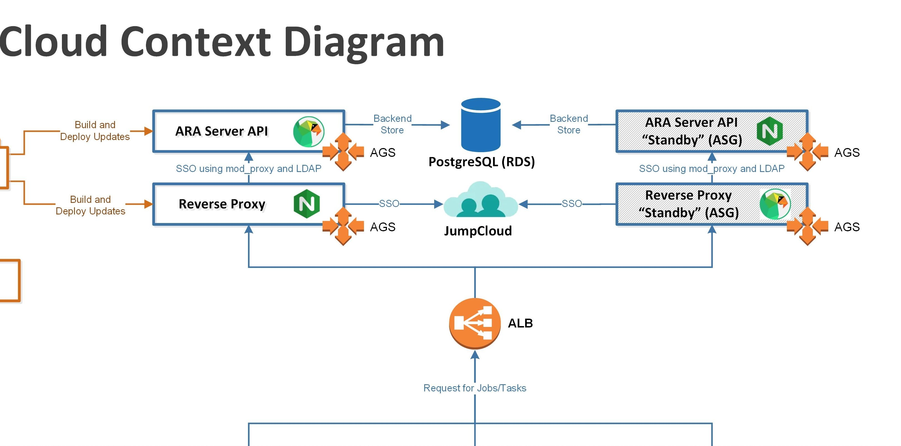

# ara_api-server-ansible

**ARA-API-Server-GitLab_Automation:**
-----------------------------------------------------------------------------------

This repository contains:
-  Cloudformation template to provision Infrastructure on AWS 
-  Ansible role and playbooks to install and configure applications.

**Architecture:**

  

- Contains Cloudformation template to create VPC (including networking, EC2 and RDS)
- Ansible roles to install and configure Ara-api_Server and Nginx (as reverse proxy) using default file.
- Cloudformation to create ASG and ALB to balance and scale EC2 instances.


**How to Install:**
The deployment of this repository uses a combination of Cloudformation for provisioning and Ansible for configuration which eliminates any manual step and no CLI command is required.
 
 Requirement:
- SSH Key-Pair still need to be shared/exported within AWS account.
- Unique Stackname should be provided with $STACK_NAME.

Development Environment:
- When changes are pushed to the development branch, this initates the CICD pipeline which performs the necessary checks (e.g. linting and syntax checks) to minimise deployment issues.

Production Environment:
- Changes have to be merged via a merge request into the main branch.
- When changes are merged to the main branch, this initates the CICD pipeline which performs the necessary checks (e.g. linting and syntax checks) to minimise deployment issues

Directory Structure:
```
.
├── ansible
│   ├── ansible-ara.pem
│   ├── ansible.cfg
│   ├── image_id.txt
│   ├── inventory
│   │   ├── 000_global_vars
│   │   │   ├── 000_all_vars.yml
│   │   │   ├── 000_bastion_vars.yml
│   │   │   └── 000_private_vars.yml
│   │   ├── development
│   │   │   ├── group_vars
│   │   │   │   ├── all
│   │   │   │   │   ├── 000_all_vars -> ../../../000_global_vars/000_all_vars.yml
│   │   │   │   │   ├── vars.yml
│   │   │   │   │   └── vault
│   │   │   │   ├── bastion
│   │   │   │   │   ├── 000_bastion_vars -> ../../../000_global_vars/000_bastion_vars.yml
│   │   │   │   │   └── vars.yml
│   │   │   │   └── private
│   │   │   │       ├── 000_private_vars -> ../../../000_global_vars/000_private_vars.yml
│   │   │   │       └── vars.yml
│   │   │   └── hosts
│   │   └── production
│   │       ├── group_vars
│   │       │   ├── all
│   │       │   │   ├── 000_all_vars -> ../../../000_global_vars/000_all_vars.yml
│   │       │   │   ├── vars.yml
│   │       │   │   └── vault
│   │       │   ├── bastion
│   │       │   │   ├── 000_bastion_vars -> ../../../000_global_vars/000_bastion_vars.yml
│   │       │   │   └── vars.yml
│   │       │   └── private
│   │       │       ├── 000_private_vars -> ../../../000_global_vars/000_private_vars.yml
│   │       │       └── vars.yml
│   │       └── hosts
│   ├── requirements.txt
│   ├── roles
│   │   ├── ara_api
│   │   │   ├── defaults
│   │   │   │   └── main.yaml
│   │   │   ├── files
│   │   │   │   └── ara-gunicorn.te
│   │   │   ├── handlers
│   │   │   │   └── main.yaml
│   │   │   ├── meta
│   │   │   │   └── main.yaml
│   │   │   ├── README.md
│   │   │   ├── tasks
│   │   │   │   ├── config.yaml
│   │   │   │   ├── database_engine
│   │   │   │   │   ├── ara.server.db.backends.distributed_sqlite.yaml
│   │   │   │   │   ├── django.db.backends.mysql.yaml
│   │   │   │   │   ├── django.db.backends.postgresql.yaml
│   │   │   │   │   └── django.db.backends.sqlite3.yaml
│   │   │   │   ├── install
│   │   │   │   │   ├── distribution.yaml
│   │   │   │   │   ├── pypi.yaml
│   │   │   │   │   └── source.yaml
│   │   │   │   ├── main.yaml
│   │   │   │   ├── pre-requirements.yaml
│   │   │   │   └── wsgi_server
│   │   │   │       └── gunicorn.yaml
│   │   │   ├── templates
│   │   │   │   └── ara-api.service.j2
│   │   │   └── vars
│   │   │       ├── CentOS.yaml
│   │   │       ├── Debian.yaml -> Ubuntu.yaml
│   │   │       ├── Fedora.yaml
│   │   │       ├── RedHat.yaml -> CentOS.yaml
│   │   │       └── Ubuntu.yaml
│   │   ├── ec2-ami-create
│   │   │   ├── defaults
│   │   │   │   └── main.yml
│   │   │   └── tasks
│   │   │       └── main.yml
│   │   └── nginx_ara
│   │       ├── defaults
│   │       │   └── main.yml
│   │       └── tasks
│   │           └── main.yml
│   └── templates
│       ├── ara-api-server.yml
│       ├── ec2-ami-ansiblePB.yml
│       └── nginx-ara.yml
├── ARA-Context-Diagram-Instances.jpg
├── cloudformation
│   ├── parameters
│   │   ├── development
│   │   │   └── AWS-comtem-VPCEC2RDS-parameters.json
│   │   ├── feature
│   │   │   └── AWS-comtem-VPCEC2RDS-parameters.json
│   │   └── production
│   │       └── AWS-comtem-VPCEC2RDS-parameters.json
│   └── templates
│       ├── ALB-SG.yml
│       └── AWS-comtem-VPCEC2RDS.yml
└── README.md

38 directories, 59 files

```
